# ESG Compliance Verification System

## Introduction

The ESG Compliance Verification System is an advanced, automated tool designed to streamline the auditing of corporate sustainability reports for compliance with Environmental, Social, and Governance (ESG) standards. By integrating cutting-edge artificial intelligence, robust data extraction techniques, and a **triangular Retrieval-Augmented Generation (RAG) system**, it delivers fast, accurate, and standards-focused compliance audits. The system processes a company report in approximately 90 seconds, producing a detailed CSV report and a rich, professional PDF report that mirrors the structure and aesthetics of a provided HTML report template. It is optimized for Windows environments and designed with modularity for future integration into a Windows desktop application.

### Key Features
- **Fast Processing**: Completes an audit in ~90 seconds, including CSV and PDF generation.
- **Standards-Focused**: Strictly aligns with official ESG frameworks (GRI, IFRS S1/S2, SASB, UN Global Compact).
- **Detailed Outputs**:
  - **CSV Report**: Comprehensive audit results with summary statistics and per-criterion details.
  - **PDF Report**: Stakeholder-friendly document with tables, charts, gradients, and narratives.
- **Robust Data Extraction**: Handles diverse PDF formats (text-based, scanned) using multiple extractors.
- **Windows App Ready**: Modular design supports future GUI integration.
- **Traceability**: Links compliance results to specific standards and report pages.

This system is ideal for organizations, auditors, and stakeholders seeking efficient, reliable ESG compliance verification.

## System Components

The system comprises permanent inputs, per-report inputs, and key tools, integrated via a triangular RAG workflow.

### Permanent Inputs
- **ESG Standards**: Official documentation from ESG frameworks (e.g., GRI, IFRS S1/S2, SASB, UN Global Compact) in PDF format, stored in `C:\ESG_System\standards\`. These define compliance requirements and serve as the foundation for audits.
- **Requirements CSV**: A pre-defined checklist (`requirements.csv`) with 66 ESG criteria across Environmental (30), Social (20), and Governance (16) categories. Each criterion maps to a standard (e.g., GRI 305-1) without custom rules.

### Per-Report Input
- **Company Report**: A user-submitted PDF (e.g., sustainability or annual report) in `C:\ESG_System\input\`. Supports text-based and scanned PDFs.

### Key Tools
- **ChromaDB**: A vector database storing tagged excerpts from ESG standards for rapid retrieval during compliance checks.
- **Mistral-7B AI**: A 7-billion-parameter language model (Mistral-7B-OpenOrca, 4-bit quantized) for data extraction and compliance verification, running efficiently on CPU via `llama.cpp`.
- **PDF Extractors**:
  - `pdfplumber`: Extracts structured text and tables.
  - `PyMuPDF`: High-speed text extraction.
  - `Unstructured.io`: Handles complex layouts.
  - `pytesseract`: OCR for scanned PDFs.
- **llama.cpp**: Lightweight framework for running Mistral-7B with Q4_K_M quantization.
- **Report Generator**: Python module that compiles audit results into:
  - CSV (`audit_results.csv`): Summary and per-criterion data.
  - PDF (`audit_report.pdf`): Professional report with LaTeX, `pgfplots`, and `tikz`.

## System Architecture

The system follows a modular architecture, leveraging the triangular RAG system to integrate requirements, standards, and report document.

### Triangular RAG System
The **triangular RAG system** is the core innovation, combining:
- **Requirements (CSV)**: Defines 66 criteria to audit, ensuring framework-driven checks.
- **Standards (JSON/ChromaDB)**: Stores verbatim ESG framework rules (e.g., GRI 305-1: "Disclose annual Scope 1 emissions").
- **Report Document (PDF)**: Provides raw data for extraction and validation.

Retrieval-Augmented Generation (RAG) fetches relevant standards and requirements, augmenting the AI’s validation process for precise, traceable compliance checks.

### Architecture Diagram

```dot
digraph ESG_System {
    rankdir=LR;
    node [shape=box, fontsize=10];
    edge [fontsize=8];

    // Main Flow
    User [label="User"];
    PDF_Upload [label="PDF Upload"];
    PDF_Extractors [label="PDF Extractors\n(pdfplumber, PyMuPDF,\nUnstructured.io, pytesseract)"];
    Text_Organizer [label="Context-Preserving\nOrganizer"];
    Data_Extractor [label="Data Extractor\n(Mistral-7B via llama.cpp)"];
    Compliance_Checker [label="Compliance Checker\n(Mistral-7B)"];
    Report_Generator [label="Report Generator"];
    CSV_Report [label="CSV Report"];
    PDF_Report [label="PDF Report"];

    User -> PDF_Upload [label="Uploads PDF"];
    PDF_Upload -> PDF_Extractors [label="Processes PDF"];
    PDF_Extractors -> Text_Organizer [label="Extracted Text"];
    Text_Organizer -> Data_Extractor [label="Organized Sections"];
    Data_Extractor -> Compliance_Checker [label="Extracted Data"];
    Compliance_Checker -> Report_Generator [label="Compliance Results"];
    Report_Generator -> CSV_Report [label="Generates CSV"];
    Report_Generator -> PDF_Report [label="Generates PDF"];

    // Supporting Databases
    subgraph cluster_Databases {
        label="Permanent Resources";
        ESG_Standards_DB [label="ESG Standards DB\n(ChromaDB)"];
        Requirements_Checklist [label="Requirements Checklist\n(CSV)"];
    }

    // Interactions
    PDF_Extractors -> ESG_Standards_DB [style=dotted, label="References"];
    Compliance_Checker -> ESG_Standards_DB [style=dotted, label="Retrieves Standards"];
    Data_Extractor -> Requirements_Checklist [style=dotted, label="Uses Checklist"];
}
```


### Architecture Explanation
- **User**: Uploads the company report PDF.
- **PDF Extractors**: Uses `pdfplumber`, `PyMuPDF`, `Unstructured.io`, and `pytesseract` with a fallback mechanism to extract text from any PDF type.
- **Context-Preserving Organizer**: Segments text into ESG categories (Environmental, Social, Governance) based on headings and keywords.
- **Data Extractor**: Employs Mistral-7B to extract raw data (e.g., "9500 MT CO2e") and source page numbers, processing 10 criteria at a time for efficiency.
- **Compliance Checker**: Compares extracted data against standards retrieved from ChromaDB, determining compliance status and reasons.
- **Report Generator**: Produces a CSV report and a LaTeX-based PDF report.
- **Permanent Resources**: ChromaDB stores ESG standards; `requirements.csv` defines audit criteria.

## How It Works

### One-Time Setup
1. **Building the ESG Standards Database**:
   - Split ESG standards PDFs into logical sections (e.g., by standard code or topic).
   - Tag sections with metadata (framework, standard code, topic).
   - Embed and store in ChromaDB using `sentence-transformers` for vector-based retrieval.
2. **Preparing the Requirements Checklist**:
   - Load `requirements.csv` with 66 criteria, mapping each to standards (e.g., GRI 305-1).
   - Ensures audits are framework-driven, avoiding custom rules.

### Report Processing
1. **Adaptive Text Extraction**:
   - Uses a fallback mechanism (`pdfplumber` → `PyMuPDF` → `Unstructured.io` → `pytesseract`) to extract text, tables, and page numbers.
2. **Context-Preserving Organization**:
   - Segments extracted text into ESG categories using headings, keywords, and context.
3. **Pure Data Extraction**:
   - Mistral-7B extracts specific values (e.g., "9500"), units (e.g., "MT CO2e"), and page numbers without interpretation.
4. **Standards-Based Compliance Check**:
   - Retrieves standards from ChromaDB for each criterion.
   - Compares extracted data against verbatim requirements (e.g., "Disclose annual Scope 1 emissions").
   - Assigns status (Compliant/Non-Compliant) and reasons.
5. **Report Generation**:
   - **CSV**: Combines summary statistics (e.g., 89.4% compliance) and per-criterion details.
   - **PDF**: Uses LaTeX template to generate a stakeholder-friendly report with tables, charts, and narratives.

## Installation

### System Requirements
- **Operating System**: Windows 10 or 11 (64-bit).
- **RAM**: Minimum 8GB (16GB recommended).
- **Storage**: 10GB free (for models, libraries, LaTeX, and databases).
- **Internet Connection**: Required for initial downloads.

### Software Installation
1. **Install Python 3.10**:
   - Download from [python.org](https://www.python.org).
   - Check "Add Python to PATH" during installation.
   - Verify: `python --version`.
2. **Install Python Libraries**:
   ```bash
   pip install chromadb pdfplumber pymupdf unstructured pytesseract sentence-transformers pandas jinja2
   ```
3. **Install Tesseract OCR**:
   - Download from [GitHub](https://github.com/UB-Mannheim/tesseract/wiki).
   - Install to `C:\Program Files\Tesseract-OCR\`.
   - Add to system PATH.
   - Verify: `tesseract --version`.
4. **Install LaTeX**:
   - Install TeX Live or MiKTeX (~5GB) from [https://www.tug.org/texlive/](https://www.tug.org/texlive/).
   - Ensure `latexmk` is accessible: `latexmk --version`.
5. **Download Mistral-7B Model**:
   - Get `mistral-7b-openorca.Q4_K_M.gguf` (~4GB) from Hugging Face.
   - Place in `C:\ESG_System\models\`.

### ESG Standards Setup
1. **Prepare Input Files**:
   - Place ESG standards PDF (`ESG_Framework.pdf`) and `requirements.csv` in `C:\ESG_System\standards\`.
2. **Initialize Database**:
   ```bash
   python build_database.py --standards "C:\ESG_System\standards\ESG_Framework.pdf" --csv "C:\ESG_System\standards\requirements.csv"
   ```

## Usage

### Auditing a Company Report
1. **Prepare Input**:
   - Place the company report PDF (e.g., `Company_Report.pdf`) in `C:\ESG_System\input\`.
2. **Run the Audit**:
   ```bash
   cd C:\ESG_System
   python run_audit.py --report "input\Company_Report.pdf" --output "output\"
   ```
3. **Retrieve Outputs**:
   - **CSV**: `C:\ESG_System\output\Company_Report_audit.csv`.
   - **PDF**: `C:\ESG_System\output\Company_Report_audit.pdf`.

### Command-Line Options
- `--report`: Path to input PDF (relative to `input\`).
- `--output`: Optional custom output directory (default: `C:\ESG_System\output\`).

### Future Windows App
The modular design supports integration into a graphical Windows application, allowing users to upload PDFs and view results via a user-friendly interface.

## Output Formats

### CSV Report
The CSV report includes:
- **Summary Rows**:
  ```
  SUMMARY_HEADER,SUMMARY_VALUE
  Total_Criteria_Assessed,66
  Compliant_Criteria,59
  NonCompliant_Criteria,7
  Compliance_Rate,89.4%
  Processing_Time_Seconds,78
  ```
- **Detailed Rows**:
  ```
  Document_Processed,Audit_Date,Category,Criterion,Description,Extracted_Value,Unit,Source_Page,Standard_Framework,Standard_Code,Standard_Requirement,Compliance_Status,Compliance_Reason,Human_Summary
  Acme_Corp_2023.pdf,2025-07-19 09:29:05,Environmental,Scope1_Emissions,"Total direct GHG emissions",9500,MT CO2e,23,GRI,305-1,"Disclose annual Scope 1 emissions in metric tons CO2e",Compliant,"Value disclosed per GRI 305-1","Acme Corp reported 9,500 MT CO2e on page 23, meeting GRI 305-1."
  Acme_Corp_2023.pdf,2025-07-19 09:29:05,Social,Gender_Pay_Gap,"Median earnings ratio",18.2,%,47,IFRS,S1,"Disclose gender pay gap with methodology",Non-Compliant,"No methodology provided","Acme Corp reported 18.2% on page 47 but omitted methodology, failing IFRS S1."
  ```

### PDF Report
The PDF report (`audit_report.pdf`) is generated using a LaTeX template, designed to match a provided HTML report’s professionalism and aesthetics. It includes:
1. **Cover Page** (Page 1):
   - Gradient background (emerald to blue), company logo, title, audit date, and key metrics (89.4% compliance, 59/66 criteria, 78s processing).
   - Centered layout with `\thispagestyle{empty}\setcounter{page}{1}`.
2. **Table of Contents** (Page 2):
   - Hyperlinked sections in a two-column layout.
3. **Executive Summary** (Page 3):
   - Metrics table, key achievements, and bar chart (compliant vs. non-compliant criteria).
4. **Company Profile** (Page 4):
   - Mission, vision, core values, and stats in gradient boxes.
5. **Compliance Performance** (Page 5):
   - Table and bar chart comparing framework scores (GRI: 92%, IFRS: 85%, SASB: 88%, UNGC: 95%).
6. **Detailed Analysis** (Page 6-9):
   - **Environmental (30 criteria)**: Table, emissions bar chart.
   - **Social (20 criteria)**: Table, diversity bar chart.
   - **Governance (16 criteria)**: Table, compliance pie chart.
7. **Compliance Insights** (Page 10-11):
   - Scatter plot for materiality assessment; recommendations in gradient boxes.
8. **Stakeholder Engagement** (Page 12):
   - Metrics and feedback themes; radar chart for satisfaction.
9. **Benchmarking** (Page 13):
   - Bar chart comparing Acme Corp to industry averages.
10. **Case Studies** (Page 14):
    - Examples (e.g., Solar Transformation) in gradient boxes.
11. **Future Goals** (Page 15):
    - 2025/2030 targets; roadmap progress bar chart.
12. **Conclusion** (Page 16):
    - Summary of findings in a gradient box.
13. **Appendices** (Page 17+):
    - Full 66-criteria table, historical trends, glossary, references.

### LaTeX Template Details
- **File**: `esg_compliance_report_template.tex`.
- **Packages**: `geometry`, `booktabs`, `xcolor`, `fancyhdr`, `hyperref`, `pgfplots`, `tikz`, `multicol`, `colortbl`.
- **Styling**:
  - Gradients (`tikz`) in emerald (`RGB{5,150,105}`) and blue (`RGB{8,145,178}`).
  - Colored table rows for readability.
  - 11pt `article` class for professional typography.
- **Charts**:
  - Bar (emissions, diversity, frameworks, roadmap).
  - Pie (governance compliance).
  - Radar (stakeholder satisfaction).
  - Scatter (materiality assessment).
  - All include legends and captions.
- **Integration**: Populated via `jinja2` from CSV data.

### Sample Integration Script
```python
import pandas as pd
import jinja2
import subprocess

# Load CSV
csv_path = r"C:\ESG_System\output\audit_results.csv"
df = pd.read_csv(csv_path)

# Prepare data
criteria = df.to_dict('records')
metrics = {
    "compliance_rate": 89.4,
    "total_criteria": 66,
    "compliant_criteria": 59,
    "processing_time": 78,
    "report_date": "2025-07-19 09:29:05",
    "company_name": "Acme Corp"
}

# Render LaTeX
env = jinja2.Environment(loader=jinja2.FileSystemLoader("."))
template = env.get_template("esg_compliance_report_template.tex")
output_tex = r"C:\ESG_System\output\audit_report.tex"
with open(output_tex, "w") as f:
    f.write(template.render(criteria=criteria, metrics=metrics))

# Compile PDF
subprocess.run(["latexmk", "-pdf", output_tex], cwd=r"C:\ESG_System\output")
```

## Troubleshooting
- **LaTeX Compilation**:
  - Ensure `texlive-full` and `texlive-fonts-extra` are installed.
  - Verify `latexmk` path: `latexmk --version`.
  - Check table sizes; adjust `\resizebox` if overflow occurs.
- **CSV Parsing**:
  - Validate `audit_results.csv` columns match expected format.
  - Use `pandas` to debug: `df.info()`.
- **PDF Extraction**:
  - If extraction fails, check PDF integrity (e.g., no encryption).
  - Ensure `Tesseract-OCR` is in PATH.
- **Performance**:
  - Minimum 8GB RAM; 16GB recommended.
  - Verify `mistral-7b-openorca.Q4_K_M.gguf` in `C:\ESG_System\models\`.
  - Check logs for bottlenecks.

## FAQ
- **How do I update the requirements checklist?**
  - Edit `C:\ESG_System\standards\requirements.csv`.
  - Rerun: `python build_database.py --standards "C:\ESG_System\standards\ESG_Framework.pdf" --csv "C:\ESG_System\standards\requirements.csv"`.
- **How do I add new ESG standards?**
  - Update `ESG_Framework.pdf` with new frameworks.
  - Rebuild ChromaDB: `python build_database.py --standards "C:\ESG_System\standards\ESG_Framework.pdf"`.
- **What if text extraction fails?**
  - The system uses a fallback (pdfplumber → PyMuPDF → Unstructured.io → pytesseract). Check PDF for corruption or encryption.
- **Can I process multiple reports?**
  - Currently single-report via CLI. Batch processing planned for Windows app.
- **How do I customize the PDF report?**
  - Modify `esg_compliance_report_template.tex` for styling or add charts via `pgfplots`.

## Future Enhancements
- Support additional frameworks (e.g., TCFD).
- Develop Windows GUI for PDF uploads and result visualization.
- Add batch processing for multiple reports.
- Optimize LaTeX compilation (e.g., cache intermediate files).
- Enhance charts (e.g., stacked bars for multi-year trends).

## License
MIT License. See `LICENSE` for details.

## Contact
For support, contact [support@x.ai](mailto:support@x.ai).
